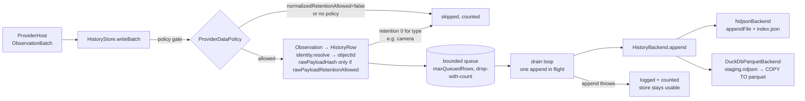

# History store

Package `@worldview/history-store` implements ADR-005: observation history in
date-partitioned files, policy-aware retention with tiered track downsampling, and
the timeline/replay controller. It never serves hot-state lookups (those live in
`@worldview/state-engine`); it answers "what was known at time T" and "where did this
object go".

## Write path



`writeBatch` is synchronous and never throws for data problems: it returns a
`WriteReceipt` (queued / skippedByPolicy / skippedByRetention / invalid / dropped).
The drain loop appends one partition at a time; a failing append is logged and counted
(`stats.failedAppends`, `lastError`) and the rows are dropped, not retried forever.
`flush()` waits for the queue and asks the backend to make everything durable.

## Replay path

```mermaid
flowchart LR
  UI[timeline.set / tick] --> TC[TimelineController\nLIVE · PAUSED · REPLAY · HISTORICAL]
  TC -->|cursor| SN[HistoryStore.snapshotAt]
  SN --> OA[backend.objectsAt\nlatest row per objectId\nobservedAt ≤ cursor, ≥ cursor − lookback]
  OA --> IDX[(index.json\nprune by type/provider/time)]
  IDX --> FILES[row files of candidate partitions]
  FILES --> RC[rowToWorldObject\nIdentityResolver.resolve → same id as live\nfreshness HISTORICAL, origin historical]
  RC --> TS[TimelineState + WorldObject[]]
  TC -->|availability| AV[backend.availability\nfrom partition metadata only]
```

`TimelineController.tick(realNowMs)` advances the cursor by `speed × elapsed` in
REPLAY (0.25 / 1 / 5 / 20 / 60) and switches to LIVE when the cursor reaches now.
Availability is derived from partition metadata and never invented: a cursor with no
partitions yields an empty snapshot and an empty availability strip.

## Partition layout

```
<dataDir>/history/
  index.json                                              partition metadata (atomic, coalesced writes)
  <objectType>/<YYYY>/<MM>/<DD>/<providerId>-<HHMM>.ndjson           NdjsonBackend rows (one JSON row per line)
  <objectType>/<YYYY>/<MM>/<DD>/<providerId>-<HHMM>.parquet          DuckDbParquetBackend rolled rows
  <objectType>/<YYYY>/<MM>/<DD>/<providerId>-<HHMM>.staging.ndjson   DuckDbParquetBackend rows not yet rolled
```

A partition is one (objectType, providerId, UTC day, slot) cell; the slot is the start
of the `slotMinutes` bucket (default 60 → `HH00`) the observation's `observedAt` falls
in. Keys derive from `observedAt`, so time queries prune from the index alone.

`index.json` holds per partition: `objectType, providerId, day, slot, minObservedAt,
maxObservedAt, rows, originalRows, bytes, downsampleTier?, rawStripped?, files?`.
`originalRows − rows` is exactly what downsampling removed. Index writes are coalesced
(100 ms) and atomic; on open the backend reconciles the index with the files on disk
(missing entries added, orphan entries dropped, size mismatches re-read), so a crash
inside the write window never leaves the index claiming rows that are not there.

Rows (`HistoryRow`): `observationId, objectId, providerId, objectType, observedAt,
receivedAt, lat?, lon?, altitudeM?, payloadJson, rawPayloadHash?, origin` plus
`externalId?, geometryJson?, sourceQuality?, seq?`. Timestamps are normalised to
millisecond UTC ISO so lexicographic order is chronological in every backend.
Malformed lines/records are counted (`diagnostics.details.malformedRowsSkipped`) and
skipped, never fatal.

## Retention

Type defaults (`DEFAULT_RETENTION_POLICIES`, overridable per type through
`HistoryStoreOptions.retention`), always capped by the provider's
`ProviderDataPolicy` via `retentionCapSeconds` (a policy can shorten, never extend):

| Object type | Retention | Raw hash kept | Downsampling |
|---|---|---|---|
| aircraft, vessel | 30 d | 24 h | tiers |
| transit-vehicle | 7 d | 24 h | tiers |
| satellite | 7 d | as row | — |
| earthquake | indefinite | as row | — |
| fire-detection | 90 d | as row | — |
| weather-alert, storm, weather-station | 30 d | as row | — |
| camera | never stored (snapshots are not history) | — | — |
| traffic-segment, sensor | 7 d | as row | — |
| launch | 90 d | as row | — |
| infrastructure, airport, port, place | indefinite | as row | — |
| user data (`providerId` in `USER_DATA_PROVIDER_IDS`) | indefinite, never thinned | as row | — |
| any other type | 7 d | as row | — |

Tiers (`TRACK_DOWNSAMPLE_TIERS`), applied by `sweepRetention(now)` to partitions whose
newest row is entirely older than the boundary:

| Partition age | Kept per object |
|---|---|
| 0–5 min | every point |
| 5–30 min | every 3rd (plus every 10th so the next tier composes exactly) |
| ≥ 30 min | every 10th |

The first and last point of each object in a partition are always kept; rows with
origin `user` are never removed. On the first rewrite each object's rows get a `seq`
ordinal that later rewrites reuse, so tier 2 after tier 1 equals tier 2 applied
directly. `rawPayloadHash` is stripped by the first rewrite after `rawSeconds`.

`sweepRetention` deletes partitions older than the effective retention, rewrites those
that crossed a tier or raw boundary, records per-partition errors and continues. A
partition whose provider currently has no data policy is skipped and reported, never
deleted on missing information. Providers without a policy are never written to in
the first place.

## Backends

`HistoryBackend` (backend.ts): `open/flush/close`, `append`, `listPartitions`,
`readPartition`, `deletePartition`, `rewritePartition`, and the query primitives
`objectsAt`, `track`, `availability`, `counts`, `observationsInRange`, `diagnostics`.
Both implementations share the partition layout and index, and both pass
`test/helpers/backend-conformance.ts`.

**NdjsonBackend** (pure Node, always available): `appendFile` per partition, streamed
reads through `readline`, scan-based queries pruned by the index.

**DuckDbParquetBackend**: appends go to `.staging.ndjson`; after `rollRows` (5000)
rows or `rollSeconds` (60) the staging file is folded into the partition's Parquet
with `COPY (SELECT … FROM read_parquet(existing) UNION ALL read_ndjson(staging)) TO
tmp (FORMAT PARQUET)` and an atomic rename. Columns are typed (lon/lat DOUBLE, seq
BIGINT, the rest VARCHAR); when the DuckDB `spatial` extension loads, a WKB
`geometry` column (`ST_AsWKB(ST_Point(lon, lat))`) is added, which keeps the files
GeoParquet-friendly (column layout, not full GeoParquet file metadata). Whether
spatial loaded is recorded in `diagnostics.details.spatialExtension`. Queries run SQL
over `read_parquet([files], union_by_name = true)` for the partitions the index
selects and merge rows still in staging, so nothing is invisible between rolls.
Leftover staging files are rolled at startup.

### Enabling DuckDB and what happens when the native module is missing

```ts
const { backend, requestedBackend, fallbackReason } = await createHistoryBackend({ dataDir, preferred: 'duckdb-parquet', logger });
const store = new HistoryStore({ dataDir, backend, requestedBackend, ...(fallbackReason ? { fallbackReason } : {}), policies, logger });
```

`@duckdb/node-api` is an optional peer dependency imported lazily inside
`DuckDbParquetBackend.open()`. If the import fails, the instance cannot be created, or
the `json` extension cannot load, `open()` throws a typed
`HistoryBackendUnavailableError`; `createHistoryBackend` then opens `NdjsonBackend`
on the same data directory, logs a warning and returns the reason.
`HistoryStore.diagnostics()` reports `kind: 'ndjson'`, `requestedBackend:
'duckdb-parquet'`, `status: 'degraded'` and `fallbackReason` — the fallback is visible
in Diagnostics, never hidden. Any other error from the preferred backend (for example
an unwritable data directory) is a real fault and is rethrown.

Type-checking without the module installed uses the declaration shim
`tools/dev/type-shims/@duckdb__node-api/index.d.ts` (recorded in
`artifacts/verification/typecheck.json`). The DuckDB tests in
`src/duckdb-backend.test.ts` run for real when the module is installed and are
SKIPPED with the load error as the reason when it is not; the NDJSON tests always run.

## Parquet files are immutable

A partition's Parquet file is never rewritten in place. Each roll writes the next
generation — `opensky-0800.parquet`, then `opensky-0800.g1.parquet`, `…g2…` — and the
previous generation is deleted only after the new one is complete and the index points
at it. Readers resolve a partition by scanning its directory for the highest generation
present, so a crash between the two steps leaves both files and the newer one wins.

This is not a stylistic preference. DuckDB caches file contents by path and assumes a
path's bytes do not change under it. The backend used to write a temporary file and
rename it over the current Parquet, which is atomic at the filesystem level and still
wrong: the next read of that path returned a stale, mixed view of two different files.
On Windows it surfaced as `No magic bytes found at end of file` and
`TProtocolException: Invalid data` — the file on disk was intact and DuckDB was not
reading it. `tools/dev/duckdb-probe.mjs` demonstrates both strategies side by side;
replacing in place fails on the second roll, a new file per roll does not.

Generation 0 carries no suffix, which is the name existing installations already hold,
so an upgrade needs no migration: the first roll after upgrading writes `g1` and removes
the file it superseded.
