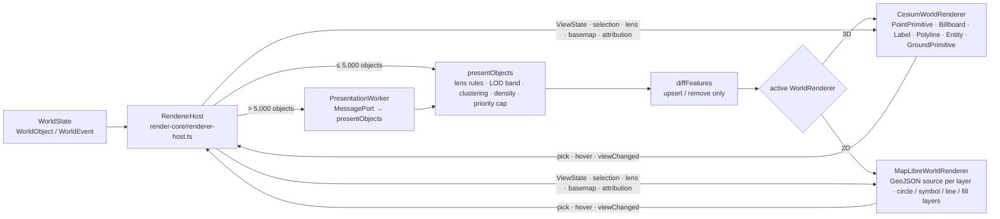

# Rendering

Packages `@worldview/render-core`, `@worldview/render-cesium`, `@worldview/render-maplibre`
and `@worldview/render-dense` implement ADR-008: one `WorldRenderer` contract, two
adapters (Cesium globe, MapLibre map), level-of-detail in the presentation layer, and a
host that owns the active adapter. Renderers never see providers, observations or raw
payloads; they consume `RenderFeature`s only (contract frozen in
`packages/render-core/src/contract.ts`).

## Pipeline

- `RendererHost` (`render-core/src/renderer-host.ts`) owns both adapters, mounts them
  lazily, resolves `AUTO` (2D when `webgl2` is false, `lowPower` is set, or the user chose
  2D for offline use without terrain), keeps ViewState / selection / lens / basemap /
  attribution in sync when switching (directive §49), suspends the hidden renderer, and
  runs presentation at most once per animation frame (`FrameCoalescer`). Above the
  worker threshold the pure `presentObjects` runs through a `PresentationWorker`
  (`PortPresentationWorker` + `servePresentation` over any MessagePort pair; the shell
  provides the Web Worker). Stale worker replies are dropped by generation.
- The theme (`render-core/src/theme.ts`) maps style classes to colours/sizes for the dark
  UI, dims `STALE` (opacity 0.5, desaturated) and `HISTORICAL`, and adds selection /
  hover outlines. The icon set (`render-core/src/icons.ts`) is drawn with canvas paths —
  no SVG or font assets — and tinted per renderer.

## Level of detail

`presentObjects` picks a mode per object type and zoom band (`DEFAULT_RULES`; a lens may
override). Clustering is screen-space grid clustering in the pipeline; MapLibre adds its
own clustering below zoom 9 for clusterable layers.

Every type is at least a point in every band. The overview is the view whose job is to
answer "what is out there", and it cannot answer that while half the types are `hidden`
and the busy ones are a heatmap — which is what the table below used to say. The cost
that used to be paid by hiding things is paid by clustering instead: at global zoom a
24 px cell is roughly 12° of longitude, so a hundred thousand aircraft become a few
hundred counted bubbles, each of which still says where its aircraft are and how many.

| Object type                             | global (< 3) | continental (3–6) | regional (6–10) | local (≥ 10)          | cluster px | density cells |
| --------------------------------------- | ------------ | ----------------- | --------------- | --------------------- | ---------- | ------------- |
| aircraft                                | points       | points            | markers         | icons + labels        | 24         | 5° / 2°       |
| vessel                                  | points       | points            | markers         | icons + labels        | 24         | 5° / 2°       |
| satellite                               | points       | points            | markers         | markers               | —          | —             |
| earthquake                              | markers      | markers           | markers         | icons + `M x.x` label | —          | —             |
| fire-detection                          | points       | points            | points          | markers               | 16         | 5° / 1°       |
| weather-alert / storm                   | markers      | markers           | markers         | icons                 | —          | —             |
| weather-station                         | points       | points            | markers         | icons                 | 20         | 5° / 1°       |
| camera                                  | points       | points            | points          | icons                 | 20         | 5° / 1°       |
| transit-vehicle                         | points       | points            | points          | icons                 | 16         | 5° / 1°       |
| airport / port / infrastructure / place | points       | points            | markers         | icons                 | 20         | 5°            |
| launch                                  | markers      | markers           | icons           | icons                 | —          | —             |
| sensor                                  | points       | points            | markers         | icons                 | 16         | 5° / 1°       |

Earthquake markers are sized by magnitude and coloured by depth; a selected object is
always drawn at `icons`, whatever its band.

### Render budget

How much of that table a machine actually gets is measured, not assumed
(`render-core/src/performance.ts`). Each renderer reports a `frame` event once a second
carrying the frame rate it achieved and the feature count it achieved it with;
`PerformanceGovernor` turns that into a rung on a fixed ladder of
`{ detail, maxFeatures }` pairs, each strictly cheaper than the one above it. Two slow
seconds step down, six fast ones step back up, and a rung that has had to be abandoned
costs more fast seconds to climb back into each time — otherwise a machine sitting
exactly on the boundary oscillates between two pictures forever.

Detail is surrendered before features are:

| Detail | Meaning                                                                                               |
| ------ | ----------------------------------------------------------------------------------------------------- |
| 0      | Full — every rule's authored mode for the band.                                                       |
| 1      | Reduced — icons become markers (no sprite, no label) and cluster cells grow by 1.8×.                  |
| 2      | Aggregate — anything with a declared density cell size collapses into counts; the rest become points. |

Dropping features makes objects _disappear_, and an operator cannot tell that apart from
"there is nothing there". Dropping detail keeps every object on screen in a cheaper form.
So the ladder spends all of its detail before it touches the feature cap, and the cap has
a floor rather than a path to an empty screen. The governor also refuses to step down at
all when the view is holding fewer features than the cheapest rung allows: a view that is
slow while drawing forty things is slow for a reason the feature budget cannot fix.

The active renderer's `capabilities.maxFeatures` caps every rung, and an explicit
`maxFeatures` on `RendererHost` (or the desktop shell) is a ceiling over the governor
rather than a replacement for it.

Cesium routes each `RenderFeature` by geometry and style (`featureRouter.ts`): point →
`PointPrimitiveCollection`, point with icon → `BillboardCollection` (sprite tinted by
colour, rotation from heading, `alignedAxis = UNIT_Z` so north stays up), label →
`LabelCollection` with a priority-based screen-space declutter pass
(`labelDeclutter.ts`), line/trail → `PolylineCollection` (dash materials), polygon /
circle → entities in a `CustomDataSource` (draped, classification BOTH), density → one
`GroundPrimitive` of colour-attributed rectangles per layer (entity rectangles where
ground primitives are unsupported), cluster → billboard disc + centred count label.
Height modes: `absolute` keeps aircraft/satellite altitudes, `clamp` draws at the surface
with `CLAMP_TO_GROUND`, `relative` offsets from the ground.

MapLibre keeps one GeoJSON source per layer (`sources.ts` diffs updates and marks dirty
layers; one `setData` per dirty layer per frame). Layer set per source (`layers.ts`):
density fill, area fill + outline, solid and dashed lines, circles, icon symbols
(`icon-allow-overlap: false`, `text-optional: true`, `symbol-sort-key` = −priority),
text-only labels, cluster discs and counts.

## Basemap and terrain registry

3D stacks (`render-cesium/src/basemaps.ts`, adapted from GEV's `MapSourceController`;
generation-counted switching, construction fallback, tile-failure fallback after 2
errors, on-screen credit that follows the stack actually shown):

Esri World Imagery is addressed as a tile tree rather than through
`ArcGisMapServerImageryProvider.fromUrl`, which cannot produce a provider without first
fetching the service document (`?f=json`). Nothing in that document is needed to address
a tile, and making it a precondition gave the only deep basemap in the build a failure
mode that has nothing to do with imagery: one refused metadata request and the stack fell
back to Natural Earth II's three levels. A tile template is synchronous, so the only thing
left that can fail is a tile — which `tileFailureFallback` already covers. When a fallback
does happen, the message carries whatever the provider actually threw, because "Esri World
Imagery is unavailable" on its own is indistinguishable between a 403, a CORS refusal and
a DNS failure.

| Stack id             | Source                                                                                                               | Credentials                         | Legal review                      | Default                           |
| -------------------- | -------------------------------------------------------------------------------------------------------------------- | ----------------------------------- | --------------------------------- | --------------------------------- |
| `natural-earth`      | Cesium's bundled Natural Earth II (`buildModuleUrl('Assets/Textures/NaturalEarthII')`) on `EllipsoidTerrainProvider` | none, no network                    | approved                          | **yes** (also the recovery stack) |
| `esri-world-imagery` | World_Imagery `/tile/{z}/{y}/{x}` via `UrlTemplateImageryProvider`, max level 19                                     | none                                | conditional (C-1)                 | no                                |
| `osm-raster`         | `OpenStreetMapImageryProvider` tile.openstreetmap.org                                                                | none                                | conditional (E-9) — never default | no                                |
| `cesium-ion-bing`    | `IonImageryProvider` asset 3                                                                                         | user's ion token                    | conditional (C-8)                 | no                                |
| `google-3d`          | `createGooglePhotorealistic3DTileset`                                                                                | user's key via `credentialRef` only | conditional (C-9 / E-8)           | no                                |
| `raster-xyz:<id>`    | `UrlTemplateImageryProvider` from a `raster-xyz` descriptor                                                          | none                                | approved unless OSM host          | no                                |
| `none`               | bare globe with the dark base colour                                                                                 | none                                | approved                          | no                                |

Terrain (`render-cesium/src/terrain.ts`, applied through `CesiumWorldRenderer.setTerrain`,
cached per descriptor, generation-guarded): `ellipsoid` (default), `quantized-mesh` URL
(e.g. Re:Earth / Mapterhorn ellipsoidal mesh, CC BY 4.0), `cesium-ion-world-terrain`
(token), `local` (worldpack terrain served by the shell).

2D styles (`render-maplibre/src/styles/worldview-dark.ts`): `pmtiles` descriptors become
the typed dark/light style for the Protomaps basemap schema over `pmtiles://` (worldpacks,
zero network); `vector-style` passes a style URL through (OpenFreeMap pending C-3 sign-off,
or a user style); `raster-xyz` / `esri-world-imagery` become raster styles; globe-only
kinds fall back to the plain dark canvas with an `error` event.

`BasemapDescriptor`s come from the map-provider registry, never from renderer code; the
shell chooses per mode and `RendererHost` remembers the choice per mode.

## Dense layers and benchmarks

`@worldview/render-dense` defines `DenseLayerRenderer` and the `NativeDenseAdapter`
that replaces a layer wholesale on the active renderer within a `DenseBudget` (per-band
caps, priority-ordered, scalable under low power). deck.gl is added only if
`tools/benchmark` shows the native adapters missing the 30 FPS heavy-region target.

`pnpm benchmark` runs the CPU-side harness (`render-dense/src/benchmark.ts`) and writes
`artifacts/verification/benchmarks/presentation.json`. It reports three medians per
case — `present` (building the frame), `diff` (comparing it with the last one) and
`frame` (both together, which is what a renderer tick actually costs) — at
1k / 10k / 50k / 100k synthetic objects across the global / regional / local bands.

Measured on the build container (Node 22, x64, 9 iterations; a shared container, so
these are indicative rather than a hardware figure):

| Objects | Band     | present |    diff |   frame | features |
| ------: | -------- | ------: | ------: | ------: | -------: |
|     10k | local    |  0.6 ms |  0.8 ms |  1.4 ms |    1,429 |
|     50k | local    |  3.4 ms |  5.7 ms |  9.0 ms |    7,143 |
|    100k | local    |  7.8 ms | 15.5 ms | 38.3 ms |   14,286 |
|    100k | regional |  7.9 ms |  1.2 ms |  8.4 ms |    1,521 |
|    100k | global   | 16.5 ms | 37.0 ms | 54.0 ms |   28,596 |

`diffFeatures` used to serialise both sides with `JSON.stringify`; it now compares
fields structurally, indexes the new frame in the same pass (the host reuses that index
instead of rebuilding it), and skips the removal scan entirely when every previous id
survived — the steady state while objects move. Isolated, the diff of a 28.6k-feature
frame takes ≈9 ms; the larger number in the table is the same work under the allocation
pressure of having just built 28.6k fresh feature objects.

That allocation is now the real cost, not the comparison: presentation rebuilds every
visible feature each tick. The next optimisation is incremental presentation (reusing
feature objects for unchanged world objects), which is a design change rather than a
tweak, and it is not needed for Release 1 — the renderer caps features at
`maxFeatures`, and presentation moves to a worker above 5,000 objects, so the UI thread
is not the one paying.

**What the headline figure means.** `frameBudgetObjectsLocal` is the largest local-zoom
set whose _whole_ in-thread update — present and diff together — fits in one 60 FPS
frame, which is 50k here. It used to be derived from the `present` median alone, which
reported 100k and was an overstatement of roughly the diff cost; the measurement now
matches what the main thread actually does. Above that, and for the 100k global case,
the work belongs in the worker — which is what the 5,000-object threshold is for.

## What needs the operator machine

Nothing here runs WebGL: the adapters are exercised in Node against fake module
surfaces (`render-cesium/src/testing/fake-cesium.ts`,
`render-maplibre/src/testing/fake-maplibre.ts`), and the real `cesium`, `maplibre-gl`
and `pmtiles` packages were not installable in the build container (declaration shims
in `tools/dev/type-shims/` stand in for their types). To verify on the operator machine:

1. `pnpm install` so the real packages replace the shims; `pnpm typecheck` must pass —
   `cesium-module.ts` and `maplibre-module.ts` are the only files typed against the
   libraries, so any signature drift surfaces there.
2. Run the tests: the two "real module" tests in `render-cesium/src/renderer.test.ts` and
   `render-maplibre/src/renderer.test.ts` stop skipping and assert the members the
   adapters rely on exist.
3. Desktop smoke test with WebGL: Natural Earth II globe renders with zero network; an
   Esri/OSM stack switch shows the credit line; a PMTiles worldpack renders offline in 2D;
   the 2D/3D switch preserves centre, zoom and selection; picks and hover work on both;
   `frame` events report ≥ 30 FPS with the presentation benchmark's 50k-object set
   loaded (the deck.gl decision point).
4. Sprite orientation: confirm billboard icons point along heading with `alignedAxis =
UNIT_Z` at high latitudes and that MapLibre `icon-rotate` matches (both use clockwise
   degrees from north).

## How the renderers reach the application

`apps/desktop/src/renderer/renderer-host.ts` (`DesktopRendererHost`) owns both adapters
and is what `main.tsx` installs in Electron. It mounts one renderer at a time into its
own pane, and holds the state a mode switch has to carry across: features, view,
selection, basemap per mode, terrain and attribution. Both libraries are imported
lazily, so a session that never leaves 2D never constructs a Cesium viewer or pays for
its WebGL context.

It exists because `RendererHost` in render-core and the shell were built to different
shapes — `RendererHost` presents a world snapshot itself, while the shell runs the
presentation pipeline and pushes a `FeatureUpdate` — and the two were never joined.
Until this adapter, `resolveHost()` fell through to the demo canvas host in _every_
build, including packaged ones: the Cesium and MapLibre adapters were written, tested and
never composed, so WORLDVIEW shipped with neither of its map renderers. The
`window.worldviewHost` hook remains as an override for a host supplied from outside; it
is no longer what production depends on.

A renderer that fails to construct is reported through the host's `error` event and the
mode does _not_ change: claiming 3D while showing nothing is worse than staying in 2D.
